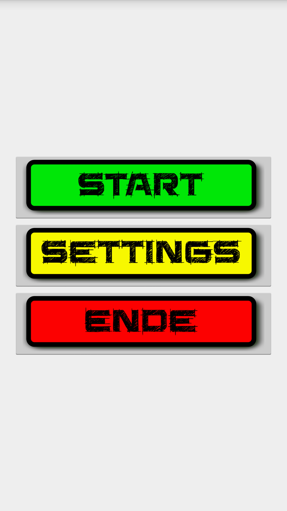
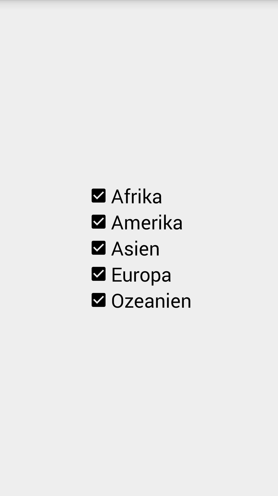
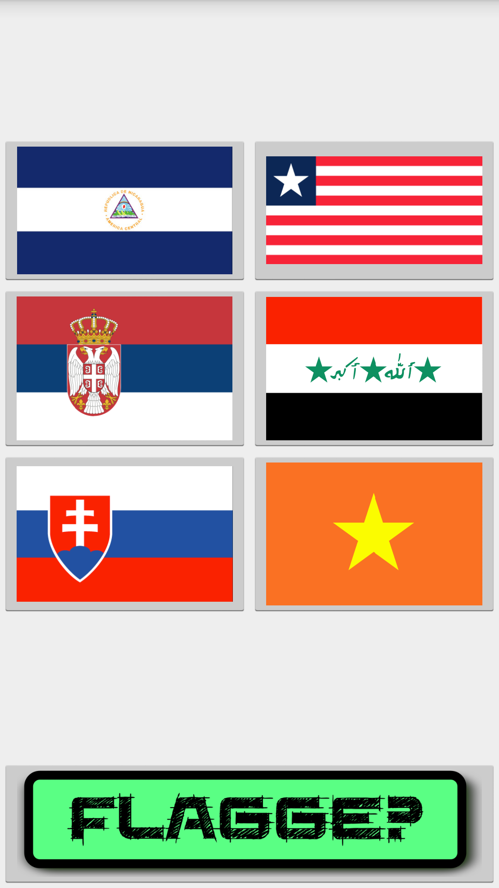
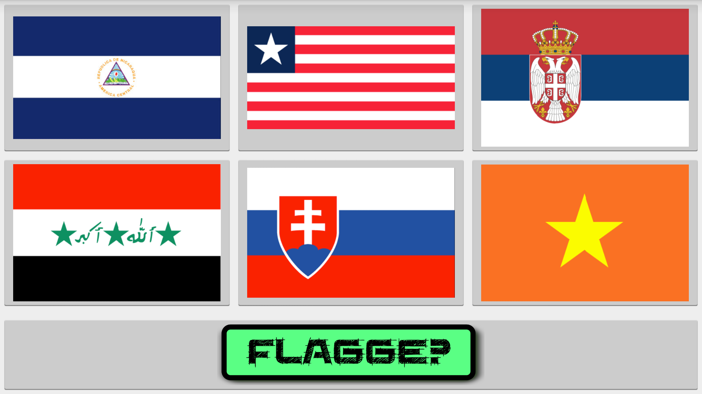

# FlagLearningGame (Android Studio 2)

Simple Flag Learning Game with Audio Files (completely in German)
- No reading is necessary - the flag name is spoken in German and there are 6 available flag choices.
- Selection is based on continents and can be configured in "Settings"

Here some screenshots:  

